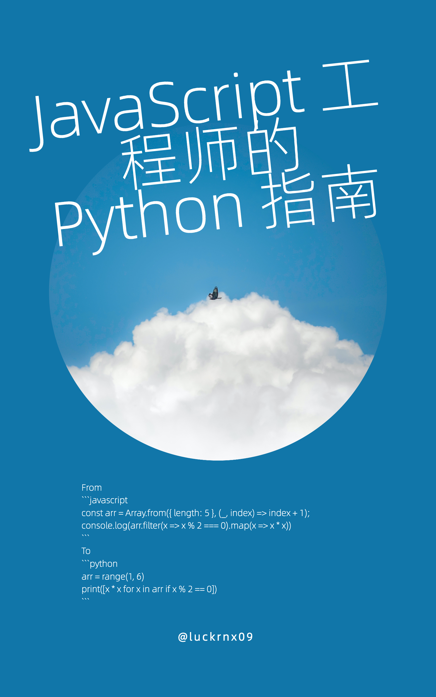

[English](./README.md) | 简体中文

# JavaScript 工程师的 Python 指南

 

《JavaScript 工程师的 Python 指南》是一本基于 [abook](https://github.com/luckrnx09/abook) 编写的开源电子书，涵盖了从 Python 环境安装到项目开发的方方面面。本书通过大量案例对比 JavaScript 和 Python 语言的异同，帮助 JavaScript 工程师快速掌握 Python 语言。

## 在线阅读

你可以在以下链接在线阅读本书：

[https://luckrnx09.com/python-guide-for-javascript-engineers/zh-cn](https://luckrnx09.com/python-guide-for-javascript-engineers/zh-cn)

## 本地阅读

感谢 [wizardforcel](https://github.com/wizardforcel) 为本书中文版制作 EPUB 格式电子书，你可以 [点击这里](https://github.com/luckrnx09/python-guide-for-javascript-engineers/files/14112960/JavaScript.Python.zip) 下载。

## 贡献者

欢迎提交 PR 对本书的内容进行补充、修正以及翻译。

## 许可证
参见 [LICENSE](./LICENSE)
