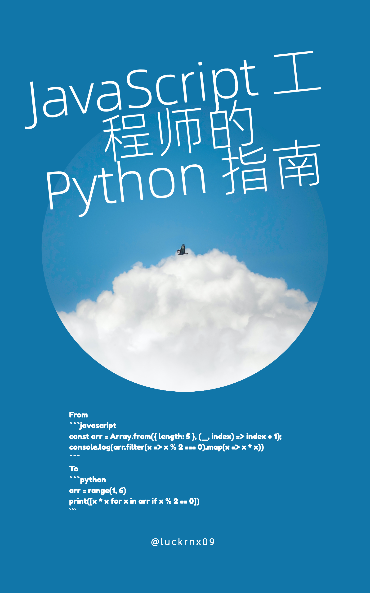

# Python Guide for JavaScript Engineers

English | [简体中文](./README-zh_CN.md)

 

The *Python Guide for JavaScript Engineers* is an open-source e-book based on [abook](https://github.com/luckrnx09/abook), covering everything from installing Python environment to project development. This book uses numerous examples to compare and contrast the similarities and differences between JavaScript and Python, helping JavaScript engineers quickly grasp the Python language.

## Online Reading

You can read this book online at the following link:

[https://luckrnx09.com/python-guide-for-javascript-engineers](https://luckrnx09.com/python-guide-for-javascript-engineers)

## Contributors

Contributions are welcome to supplement, correct, and translate the content of this book. Please submit PRs for any changes.

## License
See [LICENSE](./LICENSE) for details.