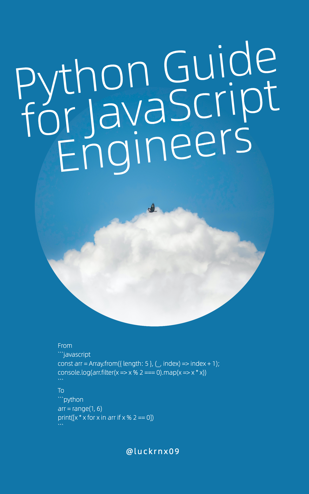

 English | <a href="./README-zh_CN.md">简体中文</a>
  
An open-source ebook powered by <a 
  target="_blank" href="https://github.com/luckrnx09/abook">abook</a>

    

The Python Guide for JavaScript Engineers is an open source ebook that covers everything from Python environment installation to project development. This book compares the similarities and differences between JavaScript and Python through cases to help JavaScript engineers quickly master the Python language.

 <a target="_blank" href="https://luckrnx09.github.io/python-guide-for-javascript-engineers">Read it online 🚀</a> 

Welcome to submit PR to supplement, revise and translate the content of this book.